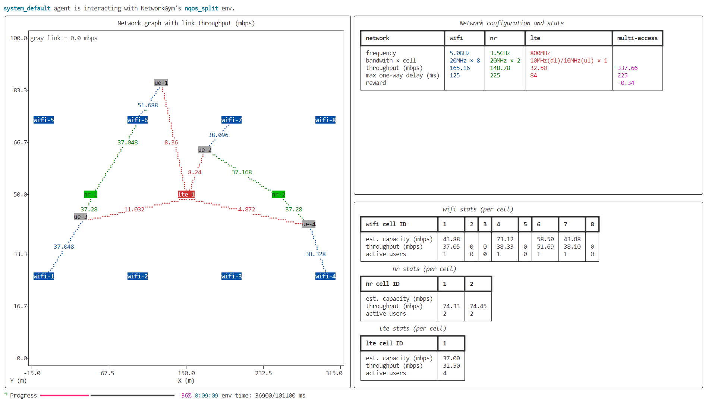

# NetworkGym Client

📋 **[NetworkGym Docs Website](https://netsim-llc.github.io/networkgym)**

📧 **[Contact Us](mailto:support@netsimsolutions.com)**

The NetworkGym Client stands as a Python-centric client library created for NetworkGym, an innovative Simulation-as-a-Service framework crafted to democratize network AI research and development. This Client establishes a remote connection to the NetworkGym Server/Environment hosted on the cloud, facilitating agent training.
At present, NetworkGym Client supports four environments: `nqos_split`, `qos_steer`, `network_slicing` and `rmcat`.

## 💡 Overview

This repository includes the network_gym_client components. The network_gym_server and network_gym_env components are hosted in the cloud. After cloning this repository, users can launch the network_gym_client to remotely connects to the newtork_gym_server and newtork_gym_env via the northbound interface.

- network_gym_client
  - gymnasium.env: *a customized gymnasium environment that communicates with the agent.*
  - adapter: *transform the network stats measurements to obs and reward; translate action to policy that can be applied to the network.*
  - northbound_interface: *communicates network confiugration, network stats and policy between client and network_gym server/environment.*


## ⌛ Installation
1. clone this repository
   
```
git clone https://github.com/netsim-llc/networkgym.git
```

3. install Python 3.11 on Ubuntu 24.04
 
```
    sudo add-apt-repository ppa:deadsnakes/ppa
    sudo apt update
    sudo apt install python3.11
    sudo apt install python3.11-venv
```

2. create venv and install requirements.txt 

```
    python3.11 -m venv myenv
    source myenv/bin/activate
    pip3 install -r requirements.txt
```


3. create common_config_local.json

```
   cd ./network_gym_client
   cp ./common_config.json ./common_config_local.json
```

4. obtain your username and PAT (personal access token)

```
    - Go to ns3.netsimsolutions.com and create an account if you don't have one.
    - Go to subscription and upgrade to "Pro". 
    - Click on Account Manager (top-right corner).
    - Select Personal Access Token (available for "Pro" users only).
    - Optionally, generate a new token by clicking Refresh—note that the new token will become active after 2 hours.
```

5. update common_config_local.json

```
  "server_ip": "51.81.221.50",
  "server_port": 8088,
     ...
  "session_name": [username],
  "session_key": [PAT]
```

## 🚀 Start NetworkGym Client

- Start the demo client using the following command:
```
python3 start_client.py
```

- If "enable_terminal_redering" equals `true`, the network stats will be rendered in the terminal

- If "enable_wandb" equals `true`, you can visualize the output using the WanDB website.
- run the example python3 script for celllular RAN slicing (https://netsim-llc.github.io/networkgym/environments/mx_network_slicing/cellular_network_slicing.html#cards-mx-cellular-slicing) 

```
    python3 start_client_network_slicing.py 
```

## 📁 File Structure

```
📦 networkgym
┣ 📜 start_client.py
┗ 📂 network_gym_client
  ┣ 📜 adapter.py (➡️ WanDB)
  ┣ 📜 common_config.json
  ┣ 📜 env.py
  ┣ 📜 northbound_interface.py (➡️ network_gym_server and network_gym_env)
  ┗ 📂 envs
    ┗ 📂 [ENV_NAME]
      ┣ 📜 adapter.py
      ┗ 📜 config.json
```

- Excuting the 📜 start_client.py file will start a new simulation. To change the environment, modify the `env_name` parameter. The 📜 common_config.json is used in all environments. Depends on the selected environments, the 📜 config.json and 📜 adapter.py in the [ENV_NAME] folder will be loaded. The 📜 adapter.py helps preparing observations, rewards and actions for the selected environment.
- The 📜 start_client.py create a NetworkGym environment, which remotely connects to the ns-3 based NetworkGym Simualtor using the 📜 northbound_interface. 📜 start_client.py also uses random samples from the action space to interact with the NetworkGym environment. The results are synced to ➡️ WanDB database.

  ## 📚 How to reference "NetworkGym"?

Please use the following to reference "NetworkGym" in your paper if it is used to generate data for the paper: 

Menglei Zhang and Jing Zhu, "NetworkGym: Democratizing Network AI via Simulation-as-a-Service", https://github.com/netsim-llc/networkgym 

